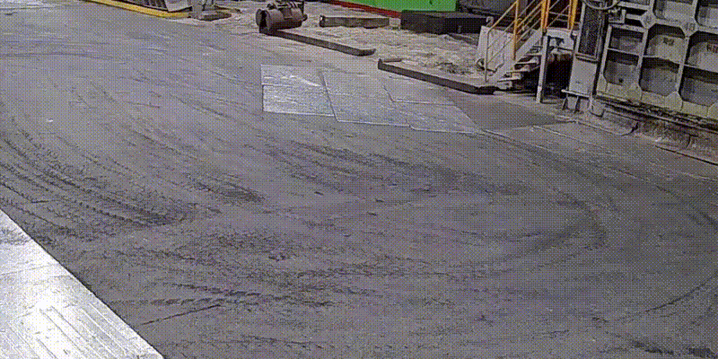
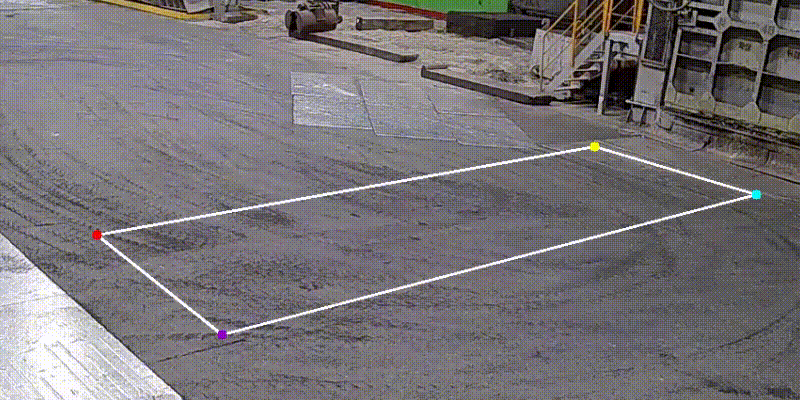
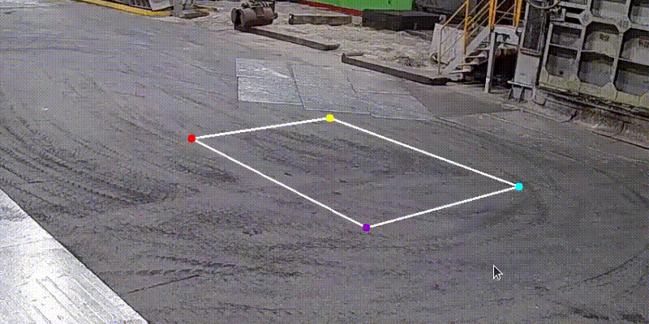
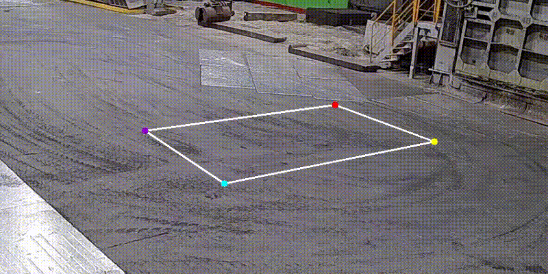
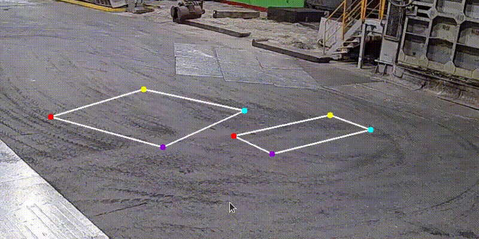

# projection_labeling_tool

## Import data

```
python import_annotations.py --ann data_to_import.json
```

## Annotate

```
python app.py --img path/to/img/ --result output.json
```

# Usage

1. Next/Previous image - Q, W

2. Create Rectangle - 2 LMB clicks



3. Move point - Drag point using LMB



4. Rotate rectangle - Drag point using RMB



5. Remove rectangle - Wheel click on point



6. Fit image to the screen - S


7. Hide figures - A



8. Export annotations - E
9. At the corner and in the terminal you see current image ID
10. Image annotations saved after moving to next/previous image or exporting annotations